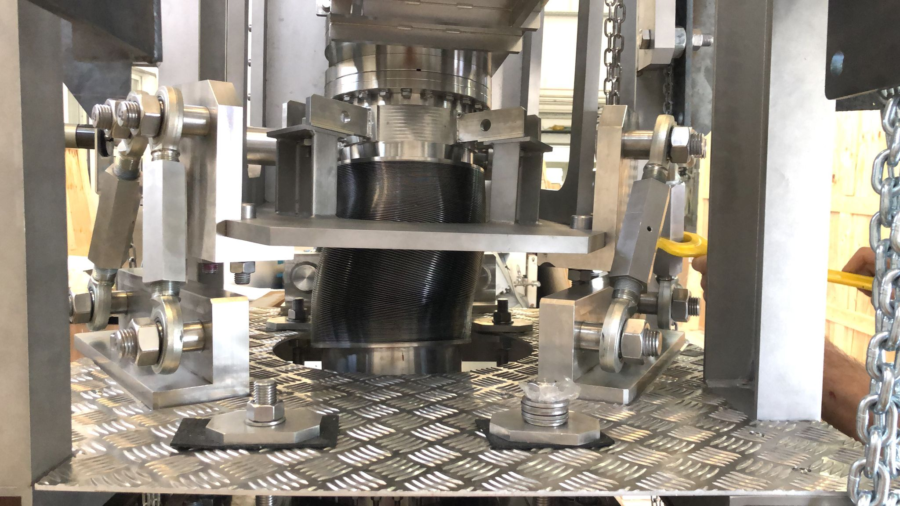
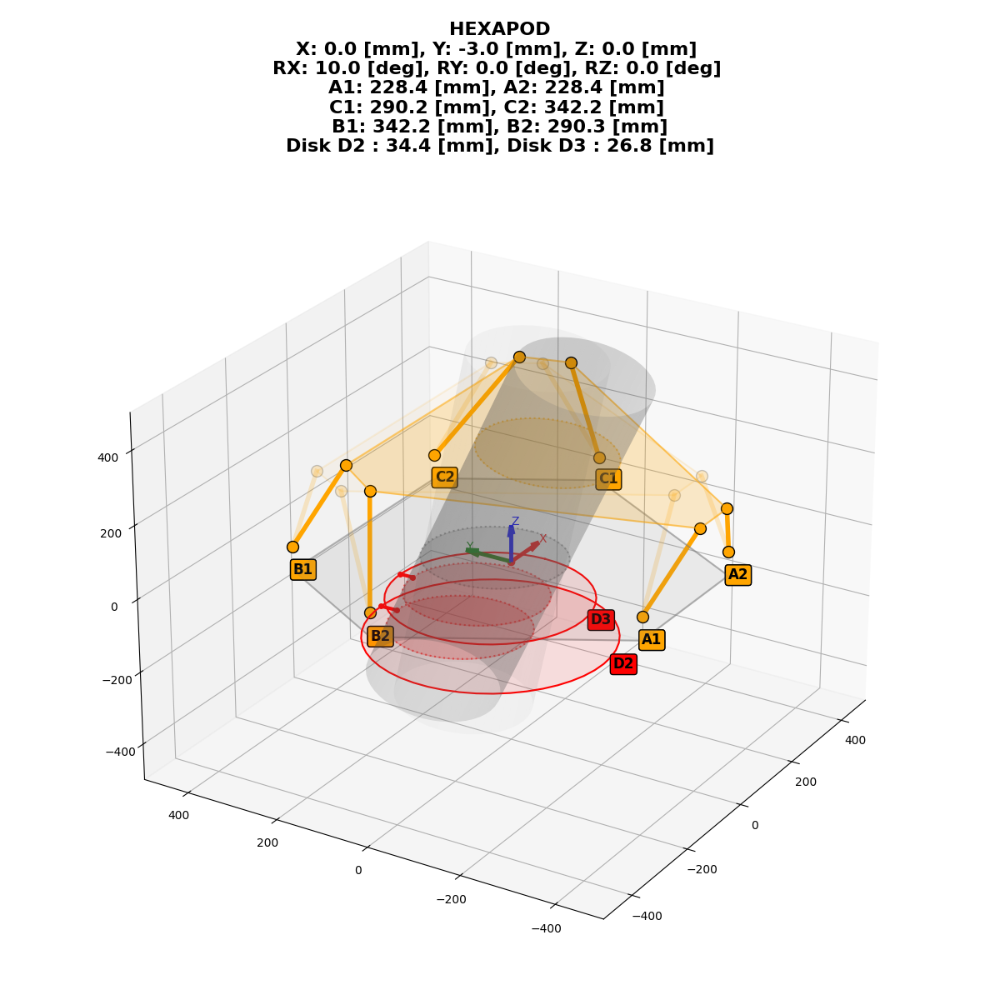

## Exapod
A simple model for achieving the desired movement of a manually actuated exapod. 



### Running the script
The only dependencies are numpy and matplotlib, any version should work.
The script allows to define the starting position of the exapod in 6 degrees of freedom (x,y,z,
roll, pitch and yaw (in radians)) and the desired 6 DOF variation. The script will then calculate
the necessary rod lengths to achieve the desired movement. Parameters not set will be set to 0. The
output depends on some geometric parameters that need to be tuned at the top of the script.

Examples: see the help
```bash
python hexapod.py -h
```



