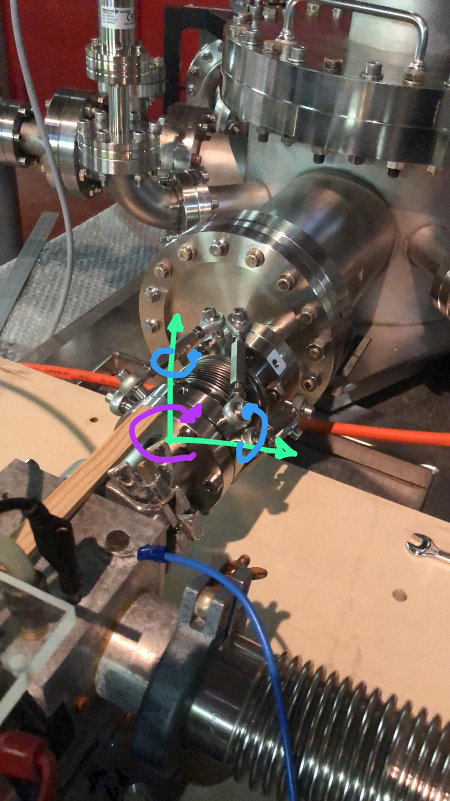

## Exapod
A simple model for achieving the desired movement of a manually actuated exapod. Only a cinematic
model so far. In the future the rods will be electronically actuated, and a dynamic model + control
system should be implemented.




### Running the script
The only dependencies are numpy and matplotlib, any version should work.
The script allows to define the starting position of the exapod in 6 degrees of freedom (x,y,z,
roll, pitch and yaw (in radians)) and the desired 6 DOF variation. The script will then calculate
the necessary rod lengths to achieve the desired movement. Parameters not set will be set to 0. The
output depends on some geometric parameters that need to be tuned at the top of the script.

Examples:
```bash
# full inputs
python exapod.py -dx 0.03 -dy 0.01 -dz 0.008 -drx 0.03 -dry -0.157 -drz 0.0 -x1 -0.01 -y1 0.0 -z1 0.08 -rx1 0.09 -ry1 0.076 -rz1 1.047

# partial inputs
python exapod.py -dx 0.03 -dy 0.01 -dz 0.008 -dry -0.157 -z1 0.08 -rz1 1.047

# full inputs equivalent
python exapod.py -dx=0.03 -dy=0.01 -dz=0.008 -drx=0.0 -dry=-0.157 -drz=0.0 -x1=0.0 -y1=0.0 -z1=0.08 -rx1=0.09 -ry1=0.076 -rz1=1.047

# partial inputs equivalent
python exapod.py -dx=0.03 -dy=0.01 -dz=0.008 -dry=-0.157 -z1=0.08 -rz1=1.047
```

Output:
```bash
Exapod:
[ x1:  -0.0100, y1:  +0.0000, z1:  +0.0800 ]
[ rx1: +0.0900, ry1: +0.0760, rz1: +1.0470 ]
[ dx:  +0.0300, dy:  +0.0100, dz:  +0.0080 ]
[ drx: +0.0300, dry: -0.1570, drz: +0.0000 ]

rod A: [0.0893 -> 0.1021] [ΔA = +0.0128] [turns_A = +12.8]
rod B: [0.0859 -> 0.1086] [ΔB = +0.0227] [turns_B = +22.7]
rod C: [0.0927 -> 0.0871] [ΔC = -0.0057] [turns_C = -5.7]
rod D: [0.0909 -> 0.0913] [ΔD = +0.0004] [turns_D = +0.4]
rod E: [0.0776 -> 0.0988] [ΔE = +0.0212] [turns_E = +21.2]
rod F: [0.0831 -> 0.0880] [ΔF = +0.0049] [turns_F = +4.9]
```


